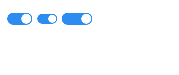
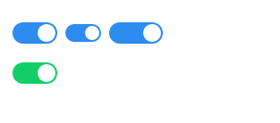

> ## **认识组件**

组件是 Vue 强大的功能之一。Vue组件具有封装可复用的特点，能够让你在复杂的应用中拆分成独立模块使用。注意，所有的 Vue 组件同时也都是 Vue 的实例，可接受相同的选项对象。      

## **Vue组件的注册**

我们可以通过全局注册和局部注册的方式来注册一个 Vue 组件，两种方式的区别在于，全局注册的组件能够在任何地方使用，其实就是所有的 Vue 实例化的时候都会去渲染这个全局组件；而局部组件只是注册在某一个 Vue 实例化对象上，只能在这个 Vue 实例化的时候会渲染，其他地方使用会被当成普通的Html标签渲染。我们就先来了解下全局组件的注册。     
Vue 组件全局注册时通过 `Vue.component(tagName, options)` 方式注册。  看一个简单的示例。

```javascript
<div id="app" class="demo">
    <!-- Vue组件 -->
    <simple-component></simple-component>
</div>
<script>
    Vue.component("simple-component", {
        template: "<span>我是一个最简单的Vue组件示例</span>"
    })
    new Vue({
        el: "#app"
    })
</script>
```
Vue.component 方法中传入两个参数，一个参数是组件的自定义标签名，另一个参数是一个对象，里面的template属性的值就是组件的模板。

可能你会想，组件的内容太简单了吧，只有一个标签，要是内容复杂点的组件，难道也要像以前一样用字符串把内容都拼接起来吗？感觉太恐怖了，就算是使用了es6的字符串语法，写下去也是一大推，很不优雅感觉。嗯，是的，针对这个问题，在 Vue 中给出了良好的解决方案，可以使用 `<script type="x-template">` 标签来处理复杂的组件模板。

```javascript
<div id="app2" class="demo">
    <vut-button></vut-button>
</div>
<script type="x-template" id="vComponent">
    <div class="vut-button">
        <span>我是Button组件</span>
    </div>
</script>

<script>
    Vue.component("vut-button", {
        template: "#vComponent"
    })
    new Vue({
        el: "#app2"
    })
</script>
```
当然，为了能够让代码看起来更加清晰明了点，你可以使用 `template` 标签来包裹组件模板，`template` 标签在浏览器渲染过程中不会被渲染出来。

```javascript
<div id="app-test" class="demo">
    <vut-button></vut-button>
</div>
<template id="vComponent">
    <div class="vut-button">
        <span>我是Button组件</span>
    </div>
</template>

<script>
    Vue.component("vut-button", {
        template: "#vComponent"
    })
    new Vue({
        el: "#app-test"
    })
</script>
```
好了，那么局部组件应该怎么注册呢？你可以通过在Vue实例选项`components`注册仅在其作用域中可用的局部组件。
```javascript
<div id="app-local" class="demo">
    <!-- Vue组件 -->
    <simple-component></simple-component>
</div>
<script>
    new Vue({
        el: "#app-local",
        components: {
            "simple-component": {
                template: "<span>我是一个最简单的局部Vue组件示例</span>"
            }
        }
    })
</script>
```  
Vue实例选项`components`包含了一个属性，键是组件的名称，值是一个对象，包含了组件的模板等属性。

## **使用 Prop 传递数据**

每个Vue组件实例都有独立范围的作用域的，这意味着子组件的模板中无法获取到父组件的数据，那么Vue可以通过使用props参数来实现父组件向子组件传递数据。

```javascript
<div id="app" class="demo">
    <simple-component link="https://github.com/vuejs/vue"></simple-component>
</div>
<script>
    Vue.component("simple-component", {
        template: "<span>Vue的github地址是：{{ link }}</span>",
        props: ["link"]
    })
    new Vue({
        el: "#app"
    })
</script>
```
可以看到，我们定义了一个props数组接收来自父组件传递的数据，因为父组件传递的数据可能是多个。而事实上，props不一定是数组，也可以是对象，可以详细的指定父组件传递的数据规则，包括默认值，数据类型等。
```javascript
props: {
    link: {
        type: String, //数据类型
        defalut: "https://www.baidu.com/" //默认值
    }
}
```

那么父组件如何动态的传递数据给子组件呢？还记得v-bind指令的作用吗，其作用是`用于动态绑定html属性或者是组件的props值`，所以应该使用v-bind指令来动态传递数据。
```javascript
<template id="userComponent">
    <div>
        <p>用户名：{{ userName }}</p>
        <p>性别：{{ sex }}</p>
        <p>年龄：{{ age }}</p>
    </div>
</template>
<script type="text/javascript">
    Vue.component("user-component", {
        template: "#userComponent",
        props: ["userName", "sex", "age"]
    })
</script>
<div id="app2" class="demo">
    <div>
        <input type="text" v-model="userName" placeholder="请输入用户名">
        <input type="text" v-model="sex" placeholder="请输入性别">
        <input type="text" v-model="age" placeholder="请输年龄">
    </div>
    <user-component
    :user-name="userName"
    :sex="sex"
    :age="age"
    >
    </user-component>
</div>
<script type="text/javascript">
    new Vue({
        el: "#app2",
        data: {
            userName: "",
            sex: "",
            age: ""
        }
    })
</script>
```

## **使用自定义事件实现子组件向父组件通信**

我们知道，父组件使用 prop 传递数据给子组件。但子组件怎么跟父组件通信呢？这个时候 Vue 的自定义事件系统就派得上用场了。  
假设我们在写一个评论系统，评论部分是Vue组件，评论提交之后我们要将评论的内容展示出来。        
先来写出评论组件吧
```html
<template id="comment-component">
    <div class="i-comment-area">
        <textarea rows="5" class="i-textarea" placeholder="请输入内容" v-model="commentValue"></textarea>
        <div class="i-comment-submit" @click="handleSubmit">
            <span>提交</span>
        </div>
    </div>
</template>
```
评论组件模板包含了一个输入框和一个提交评论的按钮，就这么简单，然后，就全局注册这个组件
```javascript
Vue.component("i-comment", {
    template: "#comment-component",
    data: function(){
        return {
            commentValue: ""
        }
    },
    methods: {
      handleSubmit: function(){
          if(this.commentValue.length < 1){
              alert("评论不能为空");
              return;
          }
          this.$emit("content", this.commentValue);
          this.commentValue = "";
      }
    }
})
```
可能你会发现，组件里的data实例选项跟之前的写法不一样，是的，这个在写组件的时候要注意的地方，`Vue规定了组件中的data选项必须是函数`。然后给提交按钮绑定了一个点击事件`handleSubmit`，当你填写了评论内容，并点击提交评论的时候，组件会通过 `$emit(eventName)` 触发事件，并带有一个参数，就是把评论的内容传递给父组件。    

既然子组件是通过 `$emit(eventName)`来和父组件通信，那么父组件如何接收子组件传递过来的数据呢，答案是，使用 `$on(eventName)` 监听事件。

```html
<div id="simple-comment" class="demo">
    <i-comment v-on:content="commentData"></i-comment>
    <label class="title">评论列表</label>
    <ul class="comment-list">
        <li v-for="(item,index) in commentList">
            <span>{{ item.time }}</span>
            <span>{{ item.content }}</span>
        </li>
    </ul>
</div>
```
在父组件中，监听子组件中定义的事件名，并调用一个方法 `commentData`。commentData方法用来获取子组件传递给父组件的参数，这样就是一个子组件向父组件通信的过程。 可以查看[完整的例子](../example/component/props传递数据.html) 。


## **实现一个 Switch UI 组件**
接下来，通过实际动手来实现一个 Switch UI 组件。首先思考下Switch组件需要有哪些基本的API。      

> * 考虑到使用场景，需要制定不同尺寸的Switch组件，所以需要 `size` API。        
* 考虑到会出现禁止使用的场景，需要禁止和启用组件的功能，所以需要 `disabled` API。         
* 考虑到需要自定义开启和关闭时的背景颜色，所以需要 `on-color` 和 `off-color` API来自定义背景色。       
* 同理，可能需要自定义开启和关闭时显示的文字，所以需要 `on-text` 和 `off-text` API来自定义显示的文字。             
* 可能还会需要通过事件监听来获取当前的状态，并根据状态做一些操作，所以需要一个事件来监听状态的变化，所以需要 `on-change` API。          

那么基本的API都列出来了，现在就可以开始一步步实现这些功能了。首先写出组件模板的基本框架。
```html
<span :class="wrapClass">
    <span :class="switchClass" @click="handleChangeFn" ref="switch">
        <input type="hidden" :value="currentValue">
    </span>
</span>
```
然后得注册这个组件吧。
```javascript
var prefixClass = "vut-switch";
Vue.component("vut-switch",{
    template: "#switch-component",
    props: {
        value: {
            type: Boolean,
            default: false
        }
    },
    data: function(){
        return {
            currentValue: this.value //当前状态
        }
    },
    computed: {
        wrapClass: function(){
            return prefixClass + "-wrap";
        },
        switchClass: function(){
            return [
                prefixClass,
                {
                    [prefixClass + "-checked"]: this.currentValue
                }
            ];
        }
    }
})
```
基本上架子就搭建好了。 然后就开始实现那些列出来的API。先来看如何实现size尺寸。

size尺寸的值肯定是通过父组件传递过来的，所以就先在子组件中的props选项中定义好size对象。
```javascript
props: {
    value: {
        type: Boolean,
        default: false
    },
    size: String //尺寸
}
```
然后我们的思路是通过不同的样式来控制渲染出来的Switch组件。我们根据传入的不同尺寸的值来添加不同的Class值，制定不同的样式，所以switchClass计算属性中可这么写：
```javascript
switchClass: function(){
    return [
        prefixClass,
        {
            [prefixClass + "-checked"]: this.currentValue,
            [prefixClass +"-"+ this.size]: this.size
        }
    ];
}
```
然后就是添加对应的样式。
```css
/*小尺寸*/
.vut-switch-small{
    width: 40px;
    height: 20px;
}
.vut-switch-small:after{
    width: 16px;
    height: 16px;
}
.vut-switch-small.vut-switch-checked:after{
    left: 22px;
}

/*大尺寸*/
.vut-switch-large{
    width: 60px;
}
.vut-switch-large.vut-switch-checked:after{
    left: 38px;
}
```

最后我们就在Vue实例初始化模板中使用Switch组件。
```html
<vut-switch size="small"></vut-switch>
<vut-switch size="large"></vut-switch>
```

这样我们就可以控制显示Switch组件的尺寸了，效果如下：  



然后来看看如何实现自定义背景色的。同样也是先在子组件的props选项中定义好传递过来的数据。      
```javascript
props: {
    value: {
        type: Boolean,
        default: false
    },
    size: String, //尺寸
    onColor: String, //开启时的自定义背景色
    ofColor: String //关闭时的自定义背景色
}
```
然后我们通过当前的状态来控制显示不同的背景色，也就是要关注 `currentValue` 值。先来写一个设置背景色的函数，根据currentValue值的变化来设置背景色。
```javascript
setBackgroundColor: function(){
    let customColor = this.currentValue ? this.onColor : this.offColor;
    this.$refs.switch.style.backgroundColor = customColor;
}
```
然后监听currentValue值的变化来调用这个函数。
```javascript
watch: {
    currentValue: function(){
        this.setBackgroundColor();
    }
}
```
最后我们就在Vue实例初始化模板中使用Switch组件。
```html
<vut-switch on-color="#13ce66" off-color="#ff4949"></vut-switch>
```

效果如下：



完整的例子请查看 [switch组件](../example/component/todolist/switch) 。
